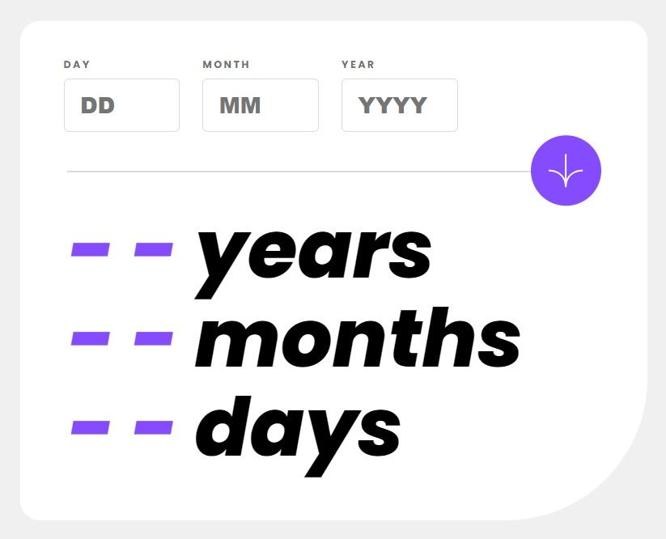

# Frontend Mentor - Age calculator app solution

This is a solution to the [Age calculator app challenge on Frontend Mentor](https://www.frontendmentor.io/challenges/age-calculator-app-dF9DFFpj-Q). Frontend Mentor challenges help you improve your coding skills by building realistic projects. 

## Table of contents

- [Overview](#overview)
  - [The challenge](#the-challenge)
  - [Screenshot](#screenshot)
  - [Links](#links)
- [My process](#my-process)
  - [Built with](#built-with)
  - [What I learned](#what-i-learned)
  - [Continued development](#continued-development)
- [Author](#author)

## Overview

### The challenge

Users should be able to:

- View an age in years, months, and days after submitting a valid date through the form
- Receive validation errors if:
  - Any field is empty when the form is submitted
  - The day number is not between 1-31
  - The month number is not between 1-12
  - The year is in the future
  - The date is invalid e.g. 31/04/1991 (there are 30 days in April)
- View the optimal layout for the interface depending on their device's screen size
- See hover and focus states for all interactive elements on the page
- **Bonus**: See the age numbers animate to their final number when the form is submitted

### Screenshot

### Links

- Solution URL: [https://www.frontendmentor.io/solutions/age-calculator-app-9GTF1pwnt6](https://www.frontendmentor.io/solutions/age-calculator-app-9GTF1pwnt6)
- Live Site URL: [https://anetakak.github.io/frontend-mentor-3/](https://anetakak.github.io/frontend-mentor-3/)

## My process

### Built with

- Semantic HTML5 markup
- CSS custom properties
- Flexbox
- Mobile-first workflow
- Vanilla JavaScript

### What I learned

I practiced creating a component to consolidate my knowledge and improve my skills. I created my first own form validation
using vanilla JavaScript.
### Continued development

I want to focus on developing my skills. I hope to solve increasingly advanced challenges.

## Author

- Github - [anetakak](https://github.com/anetakak)
- Frontend Mentor - [@anetakak](https://www.frontendmentor.io/profile/anetakak)